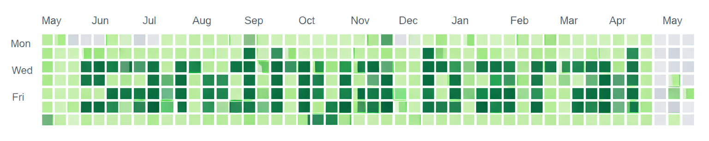

<h2 align="left"> 💻 A computer engineer, and a Learner. </h2>

---

---

### 🚀 About Me

- 🎓 Computer Engineering Graduate, Pulchowk Campus, IOE, TU  
- 🧠 Specializing in **Computer Vision, AML Monitoring & Time-series Modeling**
- 🔬 Research Interest in **3D Vision, Medical Imaging, Multi Modal Learning**
- 🧪 Experience with CNNs, RNNs, LSTMs, Autoencoders & Ensemble Models
  
---

### 🛠 Tech Stack

#### 💡 Machine Learning & AI
- Computer Vision, Pattern recognition, Object Detection 
- Time-Series Modeling (LSTM / Sequential Patterns)
- Outlier/Anomaly detection (Autoencoder / Decision Trees / Booting)

#### 🌐 Development
- PYTHON, PYTORCH
- HTML5 / CSS3
- REST APIs

---

### 🔍 Featured Work

- 🏦 **AML Alert Monitoring**
- 💵 **Cheque Monitoring System**
- 🎨 **Image Inpainting with c-GAN**
- 🚗 **Nepali License Plate Recognition**
- ✍️ **Devanagari Handwriting Dataset Creation and Benchmarking with Tranfer Learning**

---

### 📬 Connect With Me

  
  
  

---

_"Learning, beacuse I am a learner."_
